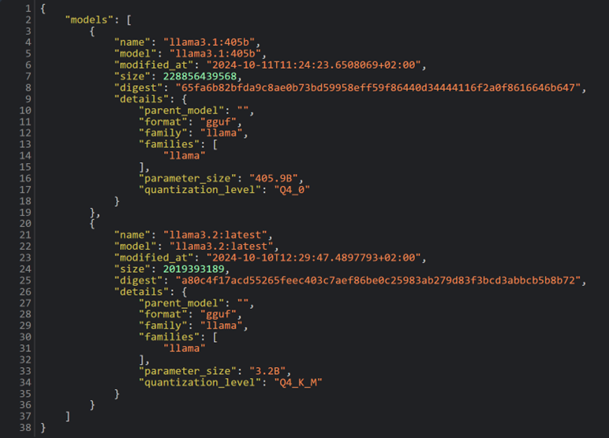

# AI-Assisted Software Engineering 3.0 Hackathon
Modern software engineering uses generative AI when developing, testing, and even specifying software. We can use tools like Github Copilot or ChatGPT to get help in specific tasks, e.g., completing the body of a function and implementing a specific algorithm. However, there are a few show-stoppers before generative AI can be used in software development companies – one is the ability to use custom models trained on the code from the company. Another is the ability to develop tools that use multiple models to achieve more advanced tasks, e.g., specify software, develop code, test the code, fix defects, etc. 

This Hackathon’s goal is to develop a tool that uses multiple models to develop, test, and optimize software for a specific task. The figure below illustrates the architecture of this tool.


The coordinator prompts LLM1 to solve a task and then prompts LLM2 to test the program developed by LLM1. If there are errors, the coordinator prompts one of the LLMs to provide the solution. 

## Three parts -- choose your own poison
This Hackathon is divided into three parts, with varying degree of challenges:
1. SimpleAI -- We create a simple program that interacts with an LLM to create programs; we use the prompt /api/generate interface, which means that we get the text out of the model, but we need to manage the conversation ourselves. 
2. ChatAI -- We create the program that controls the flow of the conversation using the /api/chat interface. We still need to keep the messages together, but we do not need to embed all of the information in the prompt any more. More like a conversation. 
3. AgenticAI -- We create classes which encapsulate conversations that we can use late on. In the main.py program, we see that we can chain two agents together and let them converse as long as we want. 

## Tests before the hackathon

In this hackathon we use two servers at Chalmers / Göteborgs Universitet that run LLaMA 3.2 models through the Ollama framework . We communicate with them using REST API. 

_Test 1:_ to check that you can connect to the server, please go to this address in your browser: deeperthought.cse.chalmers.se:80/api/tags. This should result in output like this:



If it does not work, please check the proxy settings and let me know beforehand. 

_Test 2:_ To check that you can connect to these servers from a Python script, please run the following Python program: 

```
import requests
import json
url = 'http://deeperthought.cse.chalmers.se:80/api/generate'
data = {
    "model": "llama3.2",
    "prompt": "Write a program to calculate Fibonacci numbers in Python.",
    "stream": False
    }
headers = {'Content-Type': 'application/json'}
response = requests.post(url, data=json.dumps(data), headers=headers)

json_data = json.loads(response.text)
print(json_data['response'])
```

The output should be a Fibonacci program in Python; the response should come within less than 20 seconds. If the program does not respond, please change the last line to print(json_data) and check the results. 

## Your tasks during the hackathon

### SimpleAI
1. Start with the script _starting_point.ipynb_. Finish up the script so that it takes only one input -- the specification of the program -- and creates the program together with the appropriate test cases. 
2. Create an execution environment -- execute the generated program and the test cases.
3. Create a user interface, using one of the following:
a) one of the frameworks that Ollama provides: https://github.com/ollama/ollama
b) gradio -- https://www.gradio.app/

### ChatAI
1. Start with the script _continuation_chat.ipynb_. Finish it so that you can create conversation with the model. 
2. Create the execution environment using the scripts _executer.py_ and _tester.py_
3. Use the results from the execution as part of the conversation with the model
4. Optionally -- create the user interface using gradio app

### AgenticAI
1. Read the code in _agent.py_ and _main.py_. Take a look how the agents encapsulate the conversation; look at how _main.py_ 
2. Create two new classes -- one for the executer and one for the tester -- which should use both scripts as part of the agent
3. Ask the agents to create a tic-tac-toe game in Python. 


## Useful resources
* Rosetta Code -- www.rosettacode.org - a repository of programming problems and solutions

## How to submit your solutions
If you want to, I would be happy to see pull requests with the solutions that you design (in newly created folders). That would help me to improve the Hackathon for other companies. 

## Remember
Please remember that you are sending your prompts over HTTP, i.e., pure text. I do not store any information on the servers deepthought and deeperthought, BUT it's open internet. So, do not send any company confidential data there. 